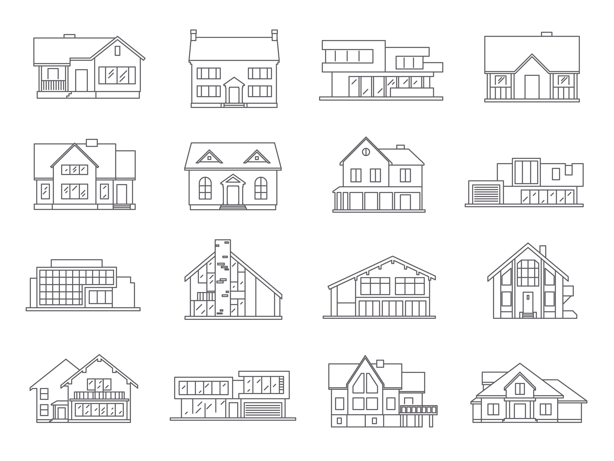

# Prediction of mansion prices in Brasilia, Brazil

<!-- PROJECT LOGO -->
<br />
<div align="center">
  <a href="https://github.com/othneildrew/Best-README-Template">
    
  </a>
  <h3 align="center">how_much_mansion_worth</h3>
  <p align="center">
    How much does a mansion in Brasilia really worth?
    <br />
    <a href="https://github.com/othneildrew/Best-README-Template"><strong>Explore the code</strong></a>
    <br />
    <br />
    <a href="https://github.com/othneildrew/Best-README-Template">View Demo</a>
    ·
    <a href="https://github.com/othneildrew/Best-README-Template/issues">Report Bug</a>
    ·
    <a href="https://github.com/othneildrew/Best-README-Template/issues">Request Feature</a>
  </p>
</div>

<!-- TABLE OF CONTENTS -->
<details>
  <summary>Table of Contents</summary>
  <ol>
    <li>
      <a href="#about-the-project">About The Project</a>
      <ul>
        <li><a href="#built-with">Built With</a></li>
      </ul>
    </li>
    <li>
      <a href="#getting-started">Getting Started</a>
      <ul>
        <li><a href="#prerequisites">Prerequisites</a></li>
        <li><a href="#installation">Installation</a></li>
      </ul>
    </li>
    <li><a href="#usage">Usage</a></li>
    <li><a href="#discussion">Discussion</a></li>
    <li><a href="#license">License</a></li>
    <li><a href="#contact">Contact</a></li>
    <li><a href="#acknowledgments">Acknowledgments</a></li>
  </ol>
</details>

<br />
<br />

<!-- ABOUT THE PROJECT -->
## About The Project

In 2021, it was reported that Flávio Bolsonaro had bought a new residence in Brasília, DF, Brazil (G1, 2021). The mansion was bought for 6 million Reais (Brazilian currency), which seemed quite chep for some people. Eduardo Moreira and many other critics of Bolsonaro’s administration have pronounced themselves, arguing that the mansion was not accurately priced given its architectonic characteristics (O Antagonista, 2021; Meteoro Brasil, 2022; UOL, 2022). Given the high interest of the critical public, the present project seeks to model real estate data to get a prediction of the price of houses and apartments in Brasília. 

Flávio’s recent acquisition has impressive characteristics: 2500 m2 lot area, 1100 m2 of covered area, 8 bathrooms, 6 bedrooms, 8 garage spots, a true mansion (O Povo, 2021; Tweeter, 2021). From the total of R$ 5.97 millions, R$ 3.1 millions were reported to be funded by Banco de Brasília (BRB). Other scandals related to the real estate market have been reported, Flávio Bolsonaro has even had his bank privacy revoked and big fluxes of money were found in recent years (Molica, 2019). Flávio’s brother, Jair Bolsonaro Junior, and his ex-step-mother have also been reported with shady, as well as other politicians in the capital. With the main characteristics of the residences, and addition of a representative sample, it’s now possible to estimate how much would those mansions cost.

The main steps covered here are:
* Web Scraping real estate data from vivareal.com.br;
* Clean and treat the raw data;
* Estimate a few models to compare the results;
* Display interactive results for general public through an API;

Naturally, given it’s a simple exploratory research, just to get a grasp of how the real estate business is like in Brasilia, results are very limited and not at all conclusive to any goal or judgment.


<p align="right">(<a href="#top">back to top</a>)</p>

### Built With

This section lists the major frameworks, libraries, and tools used to bootstrap the project..

* [Python](www.google.com)
* [Docker](www.google.com)
* [FastAPI](www.google.com)
* [GCP](www.google.com)
* [VS Code](www.google.com)

<p align="right">(<a href="#top">back to top</a>)</p>


<!-- GETTING STARTED -->
## Getting Started

The project is centered at the src/main_pipeline.py file. From there, the classes class_extract.py, class_treatment.py, and class_model are called to run each of their functions.

### Prerequisites

To apply the methods used in this project, a few packages and tools had to be prepared and installed, the ones that must be named are:

  ```
Selenium
Webdriver
BeautifulSoup
Pandas
  ```

### API

To check the results in the API, go to the address below:
www.guigo.dev.br/mansion_api


<p align="right">(<a href="#top">back to top</a>)</p>


<!-- USAGE EXAMPLES -->
## Usage

So, to get the estimated price of a residence in Brasília, given a few inputs, you can use the API as instructed below:

* Exaple 1:...;
* Exaple 2:...;
* Exaple 3:...;

_For more examples, please refer to the [Documentation](https://example.com)_

<p align="right">(<a href="#top">back to top</a>)</p>


<!-- ROADMAP -->
## Roadmap

- [x] Scrap the data
- [x] Treat the data
- [x] Model the data
- [ ] Display results at API
- [ ] Present and publish it
- [ ] Multi-language Support
    - [x] English
    - [ ] Portuguese
    - [ ] Spanish
    - [ ] German

See the [open issues](https://github.com/othneildrew/Best-README-Template/issues) for a full list of proposed features (and known issues).

<p align="right">(<a href="#top">back to top</a>)</p>


<!-- LICENSE -->
## License

...

<p align="right">(<a href="#top">back to top</a>)</p>


<!-- CONTACT -->
## Contact

Guilherme Viegas - [@your_twitter](https://twitter.com/your_username) - guilhermeviegas1993@gmail.com

Project Link: [https://github.com/your_username/repo_name](https://github.com/your_username/repo_name)

<p align="right">(<a href="#top">back to top</a>)</p>


<!-- DISCUSSION -->
## Discussion


Discussion to be done...


<p align="right">(<a href="#top">back to top</a>)</p>
